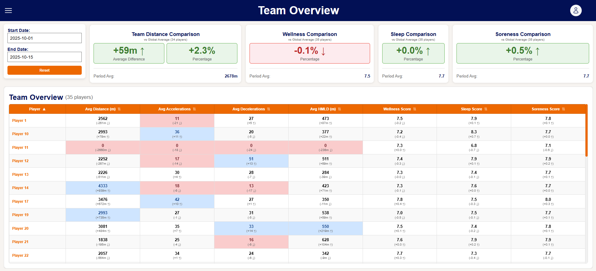
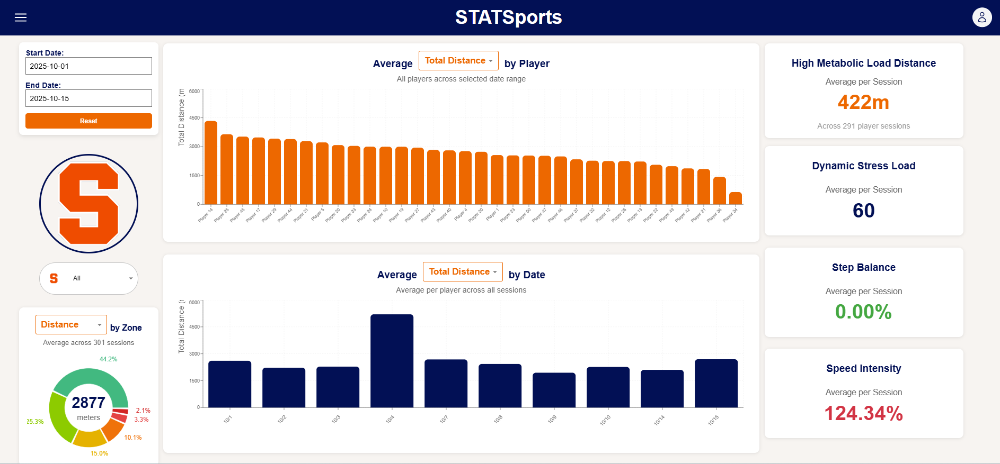
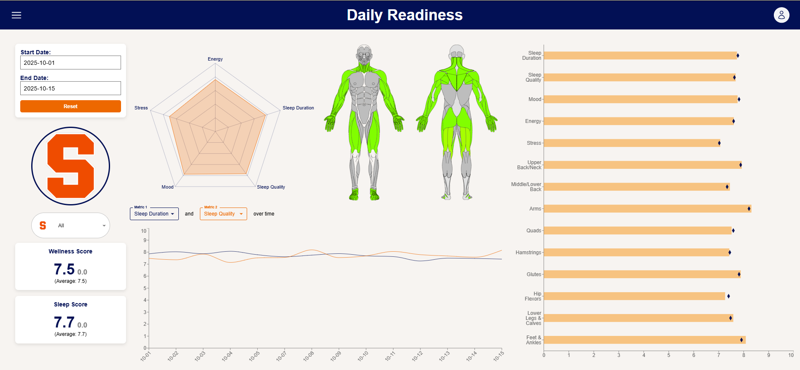
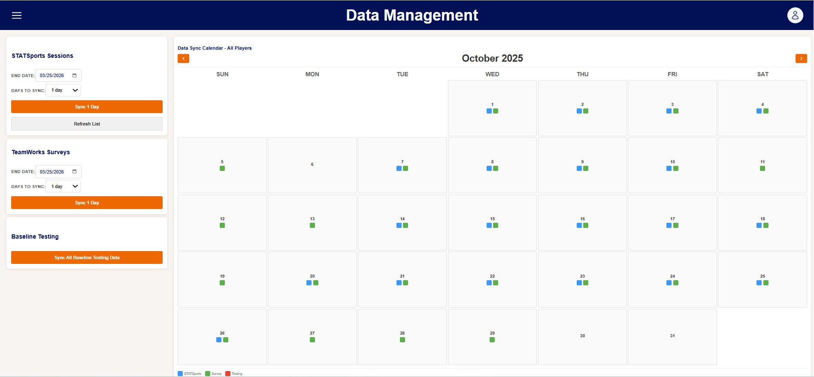

# Athlete Management System (AMS)

A full-stack web dashboard built for Syracuse Women's lacrosse coaching staff to monitor athlete health, daily readiness, and GPS performance data all in one place.

This was my first full-stack web project. In the past, I tried alternative dashboard methods like Power BI and R Shiny, but these didn't give me the freedom and customization I wanted. That led me to this project, where I wanted to design the full system from scratch. I learned a lot through this process and was able to use the site to create a weekly report for the coaching staff. Since everything is in one place, it makes for more connected and informed decisions. For example, the daily readiness survey results were previously conditionally formatted by a set value in a Google Sheet (> 8 = green, < 4 = red). With this system, you can see if a player's scores fall within 25% of their own scores, making the formatting more meaningful. 

---

## Pages

*Note: A separate database was created, and the frontend was rerouted to get the screenshots. The data values are within what we would expect from the range of values in each column. Since the data is not real, there are no insights to be gained from the screenshots themselves.*

### **Login Page:**

 
> Here, the user must be authenticated before accessing any information. Users can have 2 different roles (coach, player), where coaches gain access to additional information.

<br>

### **Team Home Page:**

> This is the main page for all basic monitoring. Conditional formatting is based on the player's own data, and the top and bottom 25% are flagged and compared to overall averages below each cell value. Additionally, team-wide values are displayed in the cards at the top to get a snapshot of how the team is performing as a whole. This is particularly useful after a strenuous practice/game, long travel day, or even during exam weeks. This page is meant for day-to-day monitoring and can be used to inform schedule changes or player check-ins. 

<br>

### **STATSports Page:**

> The STATSport page is a deeper dive into select metrics available from their API connection. The API has over 1000 total columns, so I had to pick out metrics that I thought would be the most useful. Some of the more advanced metrics are displayed in the cards on the right of the page. The charts are customizable, allowing the user to pick between Total Distance, High Speed Running, Accelerations, and Decelerations. The zone breakdown in the bottom left shows how much of the metric was achieved in a certain intensity zone threshold. This gives insight into how intense a session is. For example, a 4000m walk has more total distance than 3000m of sprints, but the sprints are more intense, which is an important distinction to visualize. Additionally, there are tooltips for charts that give exact measurements for specific data points. The player selector on the left side, below the date range selector, allows the user to look at a specific player profile.

<br>

### **Daily Readiness Page:**

> On this page, the user gets more insight into the daily surveys that players complete. When reading from left to right, the user sees a progressively more specific view of the data. The chart in the middle allows the user to see relationships between metrics over time. The most impactful visual, in my opinion, is the horizontal bar chart on the right, which compares each metric over the selected date range to its overall average with the diamond icons. Comparing players to themselves rather than to a general standard was one of the goals of this project and something that was missing from previous analyses.

<br>

### **Data Management Page:**

> This page allows the user to monitor all the data streams and make sure they are up to date. I didn't want to have a scheduled sync due to inconsistent practice and game schedules, so I instead decided on a button-based sync. This means that it is up to the user to maintain data freshness by syncing new data. The calendar also provides insight into what data has already been synced, so the user is not in the dark on what data is in the database already. 

<br>

**Testing Data (Incomplete)** — Connected to some strength testing data, and the sync system was set up. The frontend was never finalized due to a lack of need for testing data analysis. 

---

## Tech Stack

**Frontend**
- React 19 with Vite
- Recharts (radar, bar, line, donut charts)
- Material-UI (components and icons)
- React Router (page navigation)
- Axios (API requests)

**Backend**
- FastAPI (Python)
- PostgreSQL database
- SQLAlchemy ORM
- JWT authentication
- Google Sheets API integration

---

## How the Data Flows

```
GPS Wearables API  ──→  Session & drill data (60+ metrics per athlete per drill)
Google Sheets (1)  ──→  Daily wellness survey responses (35+ athletes)
Google Sheets (2)  ──→  Baseline athletic testing benchmarks

All three sources sync into PostgreSQL via the backend,
then the React frontend fetches and visualizes the data.
```

---

## Project Structure

```
backend/
├── app/
│   ├── routers/       # API endpoints (auth, surveys, GPS, testing)
│   ├── models/        # Database table definitions
│   ├── services/      # Business logic (sync, aggregation, matching)
│   └── main.py        # App entry point

frontend/ams-frontend/src/
├── pages/             # One file per page (Home, DailyReadiness, STATSports, etc.)
│   └── components/    # Charts, cards, and reusable UI pieces
├── context/           # Auth state management
└── App.jsx            # Route definitions
```

---

## What I Learned

Since this was my first time building something full-stack from scratch, there were a few things that took real debugging to figure out:

- **Timezone bugs** — JavaScript's date methods apply local timezone offsets to UTC timestamps from the API, so calendar dates were showing up one day off. Fixed by switching to UTC-specific methods (`getUTCDate()`, etc.) everywhere dates are displayed.
- **Survey date vs. sync date** — Charts were only showing one data point instead of a full date range. The backend was filtering surveys by when they were synced, not when they were actually filled out. Fixing the query column fixed the charts immediately.
- **Player name mismatches** — GPS devices store legal names ("John Doe"), but coaches write nicknames in Google Sheets ("Johnny Doe"). Built a flexible name-matching system to connect data across sources without losing records.

---

*FastAPI · React 19 · PostgreSQL · Recharts · SQLAlchemy*
